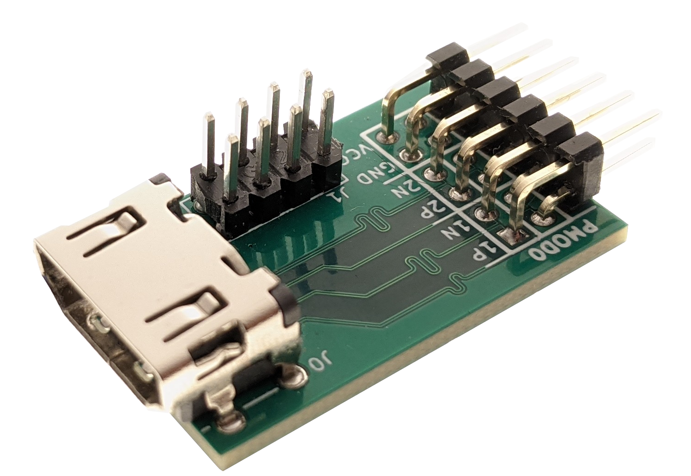

# hdmi_pmod
A simple digital video breakout board compatible with the high-speed variant of the PMOD interface by Digilent.

See my [Hackaday project page](https://hackaday.io/project/176327-hdmi-pmod) for more details.

## Ordering
I do not currently sell this board anywhere, but you may order and assemble the board yourself.

### PCB
I used [JLCPCB](https://jlcpcb.com/) as my board fab since they have a cheap, 4-layer process. To order your own board,
upload the most recent [gerber files](./gerbers/hdmi_pmod-v2.zip) to the JLCPCB website, then select the settings below.
The surface finish may be changed if you would prefer something without lead.

| Setting             | Value              |
| ------------------- | ------------------ |
| Base Material       |                    |
| Layers              | 4                  |
| Dimensions          | 31.9 mm * 20.3 mm  |
| Different Design    | 1                  |
| Delivery Format     | Single PCB         |
| PCB Thickness       | 1.6 mm             |
| Impedance           | Yes - JLC2313      |
| Surface Finish      | HASL (with lead)   |
| Outer Copper Weight | 1 oz               |
| Inner Copper Weight | 0.5 oz             |
| Gold Fingers        | No                 |
| Material Type       | FR-4 TG155         |
| Remove Order Number | Specify a location |
| Min Hole Size       | 0.45 mm            |
| Castellated Holes   | No                 |

### Components
For basic digital video over TMDS, only two components need to be placed--PMOD0 and J0 (the HDMI connector). The
resistors and J1 footprints are only there for convenience in case I decide to read EDID values some day. Digikey part
numbers can be found below.

| Reference Designator | Manufacturer Part Number | Digikey Part Number
| -------------------- | ------------------------ | -------------------
| PMOD0                | 10029449-111RLF          | [609-4614-1-ND](https://www.digikey.com/en/products/detail/amphenol-icc-fci/10029449-111RLF/2785376)
| J0                   | PH2RA-12-UA              | [2057-PH2RA-12-UA-ND](https://www.digikey.com/en/products/detail/adam-tech/PH2RA-12-UA/9830569)

## HDL
More details on the HDL code can be found in [./hdl](./hdl).

## License
The schematics, PCB, and HDL code are licensed under the Apache 2.0 license. I do not own the copyright for all of the
footprints, but to the best of my knowledge this license is compatible with all footprints in the design.

## Works that made this project possible
First I would like to credit [Will Green](/WillGreen) and the [Project F](https://projectf.io/) blog. He has some great content on how
to do video on an FPGA, and I use his display timings and DVI encoder modules in this project (you can find them
[here](/projf/projf-explore/tree/master/lib/display)).

The PMOD footprint also came from [Mithro's kicad-pmod footprint library](/mithro/kicad-pmod).
